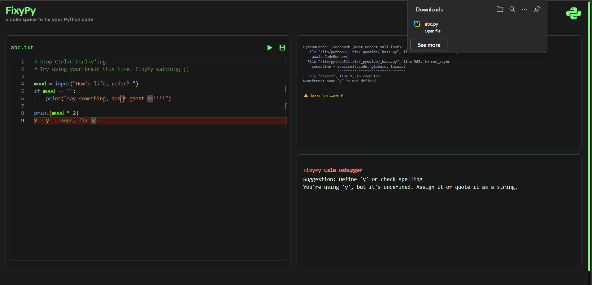

# FixyPy Lite

**FixyPy Lite** is a calm, beginner-focused Python code editor that runs entirely in the browser using [Pyodide](https://pyodide.org/). It provides meaningful suggestions and error tracing through a minimal UI built with HTML, TailwindCSS, and the Monaco Editor.

Unlike full AI assistants, FixyPy avoids overwhelming beginners with generated solutions. Instead, it uses basic regex-based analysis and clean debugging hints to encourage learning through structured trial and error.

---
## Screenshots

    
    
    
  

## Features

* Syntax-aware Python editing using **Monaco Editor**
* In-browser execution with **Pyodide**
* Calm, human-readable **error highlighting and suggestions**
* Interactive **input modal** (simulating `input()` in Python)
* Inline debugging tips without full code generation
* Fully frontend-based (no backend required)

---

## Stack

| Layer         | Tech                            |
| ------------- | ------------------------------- |
| Core Engine   | Pyodide (Python in WebAssembly) |
| Editor        | Monaco Editor                   |
| Styling       | TailwindCSS                     |
| Scripting     | Vanilla JS (modular)            |
| File Handling | In-memory (local state only)    |

---

## Philosophy

FixyPy is built on a simple idea:

> "Beginners don’t need full AI — they need space, confidence, and clean feedback."

It aims to bridge learning and debugging by offering:

* Minimal UI with no distractions
* Targeted, regex-based suggestions
* Emotional design that avoids overwhelming the user

---

## Planned Improvements

* Calm tip log (with expandable context)
* File saving to localStorage
* More advanced suggestion patterns (via trace analysis)
* Editor themes and accessibility options

---

## Contribution

FixyPy is built solo, with a focus on clarity over complexity. Suggestions are regex-based, explainable, and intentionally minimal. Contributions are welcome, but simplicity is key.
